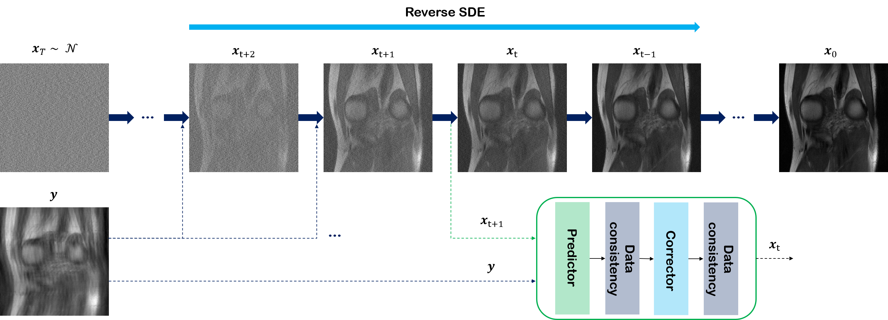

# Score-POCS for accelerated MRI

[](https://arxiv.org/abs/2110.05243)


Official PyTorch implementation of ```score-POCS```. Code was modified from [this repo](https://github.com/yang-song/score_sde_pytorch).

> **Score-based diffusion models for accelerated MRI**<br>
> [Hyungjin Chung](https://hj-chung.com) and [Jong Chul Ye](https://bispl.weebly.com/professor.html) <br>
> Medical Image Analysis 2022
> 
>**Abstract**: <br>
>Score-based diffusion models provide a powerful way to model images using the gradient of the data distribution. Leveraging the learned score function as a prior, here we introduce a way to sample data from a conditional distribution given the measurements, such that the model can be readily used for solving inverse problems in imaging, especially for accelerated MRI. In short, we train a continuous time-dependent score function with denoising score matching. Then, at the inference stage, we iterate between the numerical SDE solver and data consistency  step to achieve reconstruction. Our model requires magnitude images only for training, and yet is able to reconstruct complex-valued data, and even extends to parallel imaging. The proposed method is agnostic to sub-sampling patterns and has excellent generalization capability so that it can be used with any sampling schemes for any body parts that are not used for training data. Also, due to its generative nature, our approach can quantify uncertainty, which is not possible with standard regression settings. On top of all the advantages, our method also has very strong performance, even beating the models trained with full supervision. With extensive experiments, we verify the superiority of our method in terms of quality and practicality.

## Brief explanation of the inference procedure

Running ```sampling.get_pc_fouriercs_fast``` is equivalent to solving Algorithm 2
in the [paper](https://arxiv.org/abs/2110.05243). It iteratively applied ```N```
number of **precitor-corrector** sampling with data consistency projection steps in-between.
Hence, the reconstruction starts from random noise, gradually updated closer and closer to
a clean reconstructed image.

## Installation

```bash
source install.sh
```
Above installation script will handle downloading model weights, and installing dependencies.
Alternatively, you can download the model weights [here](?), and place it as ```weights/checkpoint_95.pth```.

## Project structure

```bash
├── configs
│   ├── default_lsun_configs.py
│   │   └── default_lsun_configs.cpython-38.pyc
│   └── ve
│       ├── fastmri_knee_320_ncsnpp_continuous.py
├── fastmri_utils.py
├── utils.py
├── models
│   ├── ...
├── op
│   ├── ...
├── samples
│   ├── ...
├── sampling.py
├── sde_lib.py
└── inference_real.py
```

1. ```configs```: contains the hyper-parameters for defining neural nets, sampling procedure, and so on.
Ordered in the form of ```ml_collections```.
2. ```fastmri_utils.py, utils.py```: ```utils.py``` contains helper functions used in pre/post-processing of data. It also
wraps ```fastmri_utils.py```, which contains helper functions related to Fourier transforms required in MRI reconstructions.
3. ```models```: This directory contains files that are required for defining the ```ncsnpp``` model, which is a
heavy U-Net architecture with several modifications including transformer atention, Fourier features, and anti-aliasing down/up-sampling.
4. ```ops```: This directory contains CUDA kernels that are used in ```ncsnpp```.
5. ```samples```: contains sample MR images to test the code.
6. ```sampling.py```: Contains Algorithm 1 of the paper. Workhorse for reconstruction.
7. ```sde_lib.py```: Defines VE-SDE of eq. (3),(4), and (6).
8. ```inference.py```: main script for inference.

## Inference

### Retrospective inference

Default mode for inference is retrospective mode. In this mode, the user needs to prepare a single image from fully-sampled k-space.
In order to specify the mask to use for under-sampling, control the following: ```--mask_type, --acc_factor, --center_fraction```.
The ```mask_type``` argument will be one of ```'gaussian1d`, 'uniform1d', 'gaussian2d' ```. For example, one can run the below command.

```python
python inference_real.py --task 'retrospective' \
                    --data '001' \
                    --mask_type 'gaussian1d' \
                    --acc_factor 4 \
                    --center_fraction 0.08 \
                    --N 2000
```

### Prospective inference

You can also perform prospective inference, given that you have matching pairs of aliased image from under-sampled k-space, and the corresponding mask.
We expect the matching filnames be ```{filename}.npy, {filename}_mask.npy```. In this case, you can run, for example, the following:

```python
python inference_real.py --task 'prospective' \
                    --data '001' \
                    --N 2000
```

### Other solvers

You can run analagous commands also with ```inference_single-coil.py```, ```inference_multi-coil_SSOS.py```, and ```inference_multi-coil_hybrid.py```. These files correspond to solving the following algorithms from the paper:
- ```inference_single-coil.py```: Algorithm 3
- ```inference_multi-coil_SSOS.py```: Algorithm 4
- ```inference_multi-coil_hybrid.py```: Algorithm 5

## Training your model from scratch

You may train your model from scratch with, e.g. ```train_fastmri_knee.sh```. Note that you must have your training data ready, and modify the config file being used.

## Related Works

We list here several outstanding works that also aim to solve MRI reconstruction in a similar fashion. 
- Solving Inverse Problems in Medical Imaging with Score-Based Generative Models: [paper](https://openreview.net/forum?id=4rFAhgrA0lA)
- Robust compressed sensing using generative models: [paper](https://proceedings.neurips.cc/paper/2020/hash/07cb5f86508f146774a2fac4373a8e50-Abstract.html), [code](https://github.com/utcsilab/csgm-mri-langevin)

## Citation
If you find our work interesting, please consider citing

```
  @article{chung2021score,
    title={Score-based diffusion models for accelerated MRI},
    author={Chung, Hyungjin and Ye, Jong Chul},
    journal={arXiv preprint arXiv:2110.05243},
    year={2021}
  }
```

